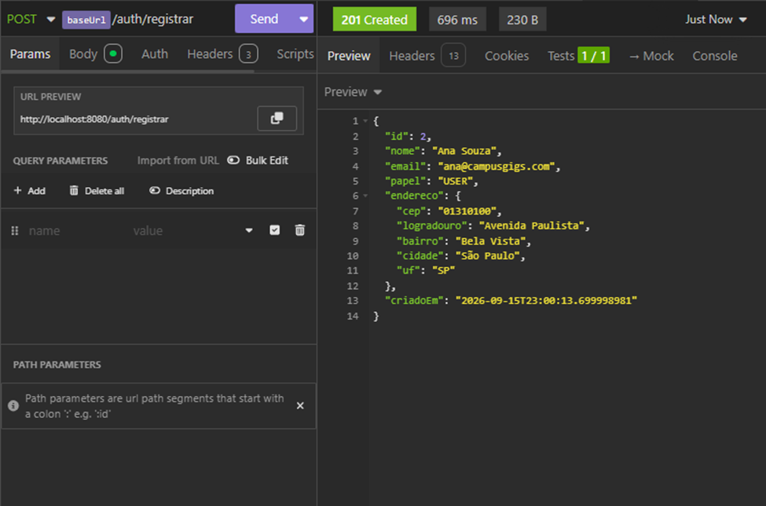
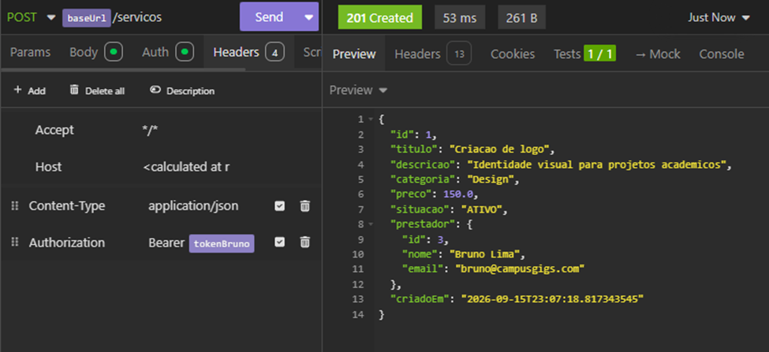
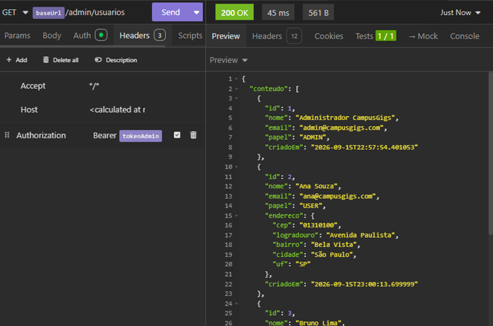

# CampusGigs — API de freelas entre alunos

API REST que sustenta uma plataforma de freelas universitários: um aluno publica um serviço, outro aluno autenticado contrata.

**Stack:** Java 21 · Spring Boot 3.4 · Spring Security (JWT) · Spring Data JPA · PostgreSQL 16 · Flyway · Docker Compose · HttpExchange (ViaCEP)

---

## Participantes

- **Pietro Abrahamian** — RM561469
- **Pedro Peres** — RM561792

## Como executar

Pré-requisito: **apenas Docker e Docker Compose**. Não é preciso instalar Java, Maven ou Postgres.

```bash
docker compose up --build
```

O compose sobe dois contêineres:

| Serviço | Porta | O que faz |
|---|---|---|
| `db`  | 5432 | PostgreSQL 16 com healthcheck |
| `api` | 8080 | A aplicação; só inicia depois que o banco responde |

A API sobe em `http://localhost:8080`. O Flyway roda as migrations automaticamente no start — o banco nasce pronto.

Para derrubar tudo (incluindo os dados):

```bash
docker compose down -v
```

### Rodando fora do Docker (opcional)

Precisa de JDK 21 + Maven e um Postgres local em `localhost:5432` com banco/usuário/senha `campusgigs`:

```bash
mvn spring-boot:run
```

---

## Usuário ADMIN

Criado pela migration `V2` (não é possível se promover a ADMIN pela API):

```
email: admin@campusgigs.com
senha: admin123
```

Qualquer cadastro feito por `POST /auth/registrar` entra como `USER`.

---

## Exemplo de chamada autenticada

**1. Cadastrar**

```bash
curl -X POST http://localhost:8080/auth/registrar \
  -H "Content-Type: application/json" \
  -d '{"nome":"Ana Souza","email":"ana@campusgigs.com","senha":"senha12345","cep":"01310-100"}'
```

Resposta `201 Created` — repare em `cidade` e `uf`, preenchidos pela integração com o ViaCEP:

```json
{
  "id": 2,
  "nome": "Ana Souza",
  "email": "ana@campusgigs.com",
  "papel": "USER",
  "endereco": {
    "cep": "01310100",
    "logradouro": "Avenida Paulista",
    "bairro": "Bela Vista",
    "cidade": "São Paulo",
    "uf": "SP"
  }
}
```

**2. Autenticar e guardar o token**

```bash
TOKEN=$(curl -s -X POST http://localhost:8080/auth/login \
  -H "Content-Type: application/json" \
  -d '{"email":"ana@campusgigs.com","senha":"senha12345"}' | sed -n 's/.*"token":"\([^"]*\)".*/\1/p')
```

**3. Chamada autenticada — publicar um freela**

```bash
curl -X POST http://localhost:8080/servicos \
  -H "Authorization: Bearer $TOKEN" \
  -H "Content-Type: application/json" \
  -d '{
        "titulo":"Monitoria de Java",
        "descricao":"Aulas particulares de POO e Spring Boot",
        "categoria":"Educacao",
        "preco":80.00
      }'
```

`201 Created`. Sem o header `Authorization`, o mesmo POST devolve `401`.

---

## Endpoints

| Método | Rota | Acesso |
|---|---|---|
| POST | `/auth/registrar` | público |
| POST | `/auth/login` | público |
| GET | `/servicos` (filtros: `situacao`, `categoria`, `page`, `size`) | público |
| GET | `/servicos/{id}` | público |
| POST | `/servicos` | autenticado |
| PUT | `/servicos/{id}` | dono do serviço |
| PATCH | `/servicos/{id}/pausar` · `/reativar` | dono do serviço |
| PATCH | `/servicos/{id}/encerrar` | dono **ou** ADMIN |
| POST | `/contratacoes` | autenticado (não pode ser o próprio serviço) |
| GET | `/contratacoes/minhas` | autenticado |
| GET | `/contratacoes/{id}` | contratante, prestador ou ADMIN |
| PATCH | `/contratacoes/{id}/aceitar` · `/concluir` | prestador do serviço |
| PATCH | `/contratacoes/{id}/cancelar` | contratante, prestador ou ADMIN |
| GET | `/usuarios/me` | autenticado |
| PUT | `/usuarios/me/cep` | autenticado |
| GET | `/usuarios/me/servicos` | autenticado |
| GET | `/admin/usuarios` | **somente ADMIN** |

---

## Autenticação e autorização

O login devolve um JWT assinado em HS256 com validade de 2h. O token carrega o e-mail (`sub`), o papel e o id — nada sensível, já que JWT é assinado e não criptografado.

A cada requisição o `JwtAuthenticationFilter` valida a assinatura, carrega o usuário e popula o `SecurityContext`. Nenhuma sessão é criada (`STATELESS`).

**Autenticado ≠ autorizado.** As duas camadas são distintas na prática:

- `401 Unauthorized` — sem token, token inválido ou expirado.
- `403 Forbidden` — token válido, mas o papel ou a titularidade do recurso não cobrem a operação.

Regras garantidas:

- qualquer usuário autenticado publica e contrata;
- um usuário só edita/pausa/encerra os próprios serviços — **exceto o ADMIN, que encerra qualquer um**;
- ninguém contrata o próprio serviço;
- serviço que não está `ATIVO` não pode ser contratado;
- nenhuma operação de escrita é acessível sem token.

---

## Tratamento de erros

Todas as violações passam pelo `GlobalExceptionHandler` e saem no formato RFC 7807 (`application/problem+json`). Stack traces ficam apenas no log do servidor.

| Status | Quando |
|---|---|
| 400 | validação de campo, corpo malformado, CEP inexistente |
| 401 | não autenticado / token inválido ou expirado |
| 403 | autenticado sem permissão (papel ou dono) |
| 404 | recurso inexistente |
| 409 | regra de negócio violada (ex.: contratar serviço pausado) |
| 503 | ViaCEP fora do ar ou com timeout |

Exemplo de 403:

```json
{
  "type": "https://campusgigs.com/erros/403",
  "title": "Acesso negado",
  "status": 403,
  "detail": "Seu papel nao permite executar esta operacao.",
  "timestamp": "2026-03-10T14:22:11.482-03:00",
  "caminho": "/admin/usuarios"
}
```

---

## Flyway

O schema é 100% versionado. `spring.jpa.hibernate.ddl-auto` está em `validate`: o Hibernate nunca cria nem altera tabela, apenas confere se o mapeamento bate com o que o Flyway construiu.

| Migration | Conteúdo |
|---|---|
| `V1__schema_inicial.sql` | tabelas `usuario`, `servico`, `contratacao`, FKs, índices e CHECKs |
| `V2__seed_usuario_admin.sql` | usuário ADMIN inicial (hash BCrypt) |
| `V3__endereco_usuario.sql` | colunas de endereço, adicionadas junto com a integração ViaCEP |

Migration aplicada nunca é editada — toda mudança de schema entra como um novo arquivo `V{n}`.

---

## Integração externa — HttpExchange

`ViaCepClient` é uma interface anotada com `@HttpExchange`; a implementação é gerada em runtime pelo `HttpServiceProxyFactory` sobre um `RestClient` (ver `HttpClientConfig`).

Três desfechos, todos explícitos — a operação nunca fica silenciosamente incompleta:

| Situação | Resposta da API |
|---|---|
| CEP válido | endereço preenchido com cidade e UF |
| CEP inexistente (ViaCEP responde `200` com `{"erro":"true"}`) | `400 Bad Request` |
| ViaCEP fora do ar, recusando ou lento | `503 Service Unavailable` |

Timeouts são explícitos (3s de conexão, 5s de leitura): sem eles, uma lentidão do ViaCEP seguraria a thread da nossa requisição até o limite do contêiner.

---

## Testes

```bash
mvn test                    # testes unitários das regras de domínio
./scripts/CampusGigs_Postman_Collection.json    
```

Criando o Perfil da Ana


Bruno publica freela


Admin lista os usuários

